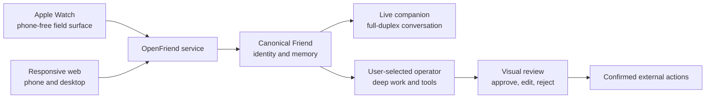

# OpenFriend

**A voice-first personal companion for responsive web and Apple Watch.**

OpenFriend is an open-source attempt to make the experience of Samantha from
_Her_ practical: a conversational presence that can listen and speak naturally,
remember with permission, think with stronger agents, and help run a life.
OpenFriend is an independent project and is not affiliated with the film or its
creators.

This is not a listening device wrapped around a command parser. The core
experience is a continuous, interruptible conversation. A live companion owns
the timing of listening and speaking while a separate background operator can
handle deeper work without freezing the conversation.

## Why responsive web and Watch?

The responsive web app is the primary early surface. It makes the same
voice-first Friend usable from phone and desktop browsers and provides visual
controls for memory, review, privacy, and diagnostics. The Apple Watch is the
strongest phone-free field demonstration: leaving the phone behind and still
being able to talk with the same intelligent, continuous companion.

The delivery sequence is deliberately narrow:

1. **Foundation** — public repo, tests, docs, deployable shell.
2. **Interaction Lab** — fluid voice on responsive phone and desktop web.
3. **The Canonical Friend** — stable identity, continuity, and permissioned
   memory.
4. **Watch Field Test** — the same Friend on an independent physical Watch
   without the phone.
5. **Bring Your Own Agent** — bounded delegation to an operator the user
   already trusts.
6. **Specialist Friends** — optional roles with explicit memory boundaries.
7. **Sharing and Network** — safe public blueprints only after the core
   relationship proves valuable.

See [the product guide](docs/PRODUCT.md) for the accepted scope.

## Current status

OpenFriend is in **Phase 0: Foundation**. The repository and web shell are being
prepared for the first Realtime conversation. It does not yet connect a
microphone, establish a voice session, write personal data, or perform external
actions.

An unsigned, Watch-only SwiftUI simulator skeleton is also available under
`apps/watch`. It proves the independent target and truthful idle state build on
the current watchOS simulator; it has no audio, networking, authentication,
signing, or physical-device behavior and does not claim Phase 3.

The initial voice profiles are configuration rather than separate code paths:

| Profile | OpenAI model            | Use                                   |
| ------- | ----------------------- | ------------------------------------- |
| Economy | `gpt-realtime-2.1-mini` | Development and routine conversations |
| Quality | `gpt-realtime-2.1`      | Conversation-quality comparison       |

Switching profiles will start a new live session. The live voice model and the
background operator model remain separate choices, allowing an economical
conversation to delegate hard work to a stronger agent.

## Architecture at a glance



The web and service use a TypeScript monorepo. The independent Watch app will be
native SwiftUI and consume the same versioned service contracts. Supabase,
Vercel, Stripe Projects, official model SDKs, and other mature infrastructure
are preferred over custom platform work.

Read [the architecture guide](docs/ARCHITECTURE.md) for boundaries and
[the foundation design](docs/plans/2026-07-26-openfriend-foundation-design.md)
for the initial rationale, and
[the voice-first product focus](docs/plans/2026-07-26-voice-first-product-focus-design.md)
for the current product boundary and story sequence.

## Local development

Prerequisites:

- Node.js 22 or newer
- pnpm 11

```bash
pnpm install
pnpm dev
```

Quality gates:

```bash
pnpm test
pnpm typecheck
pnpm lint
pnpm format:check
pnpm docs:check
pnpm build
```

`pnpm verify` runs the complete local gate once the foundation workspace lands.
No OpenAI, Supabase, or Vercel credential is required to render or test the
Phase 0 shell.

## How we build

OpenFriend is:

- **user-story driven** — changes begin with a real experience and observable
  acceptance criteria;
- **test-driven** — behavior follows red, green, refactor;
- **YAGNI-constrained** — abstractions and infrastructure must earn their place
  through an accepted near-term story;
- **agent-first** — `AGENTS.md` is a short map and `docs/` is the versioned
  system of record, following OpenAI's
  [harness-engineering guidance](https://openai.com/index/harness-engineering/).

See [CONTRIBUTING.md](CONTRIBUTING.md) and
[docs/ENGINEERING.md](docs/ENGINEERING.md).

## Privacy and trust

OpenFriend will hold intimate conversations. Data ownership, provenance,
review, deletion, and explicit approval are product requirements. Secrets stay
server-side; the Watch receives short-lived credentials; and the product never
reports an action as complete before the underlying system confirms it.

Read [docs/SECURITY.md](docs/SECURITY.md),
[docs/RELIABILITY.md](docs/RELIABILITY.md), and the
[security policy](SECURITY.md).

## Contributing

The first user is Andrew, but the project is public so others can learn from,
challenge, and improve it. Start with [CONTRIBUTING.md](CONTRIBUTING.md), the
[user-story backlog](docs/USER_STORIES.md), and the
[active plans](docs/PLANS.md).

## License

[MIT](LICENSE) © 2026 Andrew Siah and OpenFriend contributors.
