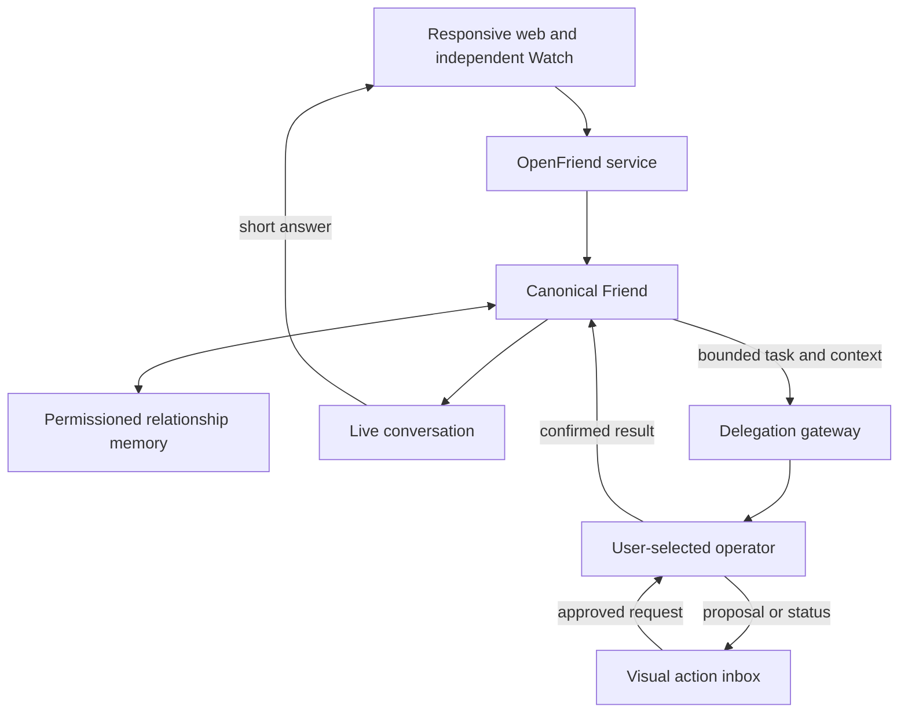

# Architecture

## System shape

OpenFriend separates the latency-sensitive conversation and durable
relationship from slower or consequential work.



### Canonical Friend

Owns the durable identity of the relationship, the conversational style,
permissioned memory, continuity across surfaces, and the decision to answer,
remember, or delegate. OpenFriend begins with one canonical Friend. A live-model
profile is replaceable configuration and must not become the Friend's identity.

### Live companion

Owns audio transport, full-duplex timing, interruptions, listening, speaking,
and short conversational responses. It must remain responsive while delegated
work is pending.

Phase 1 uses the OpenAI Realtime API through the official Agents SDK in the
responsive web app. The boundary may later host GPT-Live or another live
provider, but the application defines only profiles required by accepted
stories.

### Delegation gateway and operator

OpenFriend owns a small gateway that sends bounded work to a user-selected
operator, receives durable status, mediates approvals, and returns confirmed
results to the Friend. The external operator owns deeper reasoning, its runtime
and sandbox, tools, connectors, and action execution.

The first operator story supports one adapter. It does not create a universal
agent framework. Candidate operator surfaces include supported programmatic
interfaces from Codex, Claude Code, Hermes, or an agent-to-agent protocol. An
OpenFriend-provided default may be evaluated for users without an operator, but
is not required by the first bring-your-own-agent story.

Delegated context follows least disclosure. Friend memory is not wholesale
operator context; a task receives only the user-approved information needed for
that task.

### Specialist friends

Specialist friends are later identities with separate memory by default. Shared
user context and shared-room memories are explicit scopes. A shared friend
blueprint can eventually contain public identity and behavior, but never
inherits its creator's private history, credentials, or operator connections.

## Repository shape

```text
apps/
  web/                  Responsive Next.js voice app and visual review
  watch/                Independent SwiftUI readiness shell; voice in Phase 3
packages/
  contracts/            Framework-independent TypeScript contracts
docs/                   Versioned knowledge system and plans
scripts/                Narrow mechanical repository checks
```

Swift contracts will mirror versioned service payloads rather than importing
TypeScript. Code generation is added only if duplicated contracts become a
measured maintenance problem.

## Live-model profiles

`LiveModelProfile` is configuration for product-visible choices, not a general
provider framework. Phase 0 needs:

- stable profile ID;
- provider and provider model ID;
- display name and description;
- relative cost/quality tier;
- full-duplex audio, interruption, and tool-use capabilities.

Initial profiles:

- Economy → `gpt-realtime-2.1-mini`
- Quality → `gpt-realtime-2.1`

The deprecated `gpt-realtime-mini` identifier is prohibited. Switching profile
starts a new live session. The background operator model is configured
separately.

## Data direction

Supabase will provide Postgres, Auth, and Storage when a story first needs
durable data. Even for the personal-first product, durable rows carry explicit
user ownership.

Expected early domains are friends, conversations, transcript items, journal
entries, memory candidates, accepted memories, memory provenance, delegated
jobs, proposed actions, approval decisions, execution attempts, and session
evaluation metrics. Memory scopes distinguish user-owned shared context,
friend-private context, and later room-specific context. These are a direction,
not permission to create tables without an accepted story.

## Action lifecycle

Consequential actions follow:

```text
proposed -> awaiting_approval -> executing -> completed
                                      |       failed
                                      |       cancelled
                                      └-----> uncertain
```

Every external write receives a stable idempotency identifier. `completed`
requires confirmation from the source system. An uncertain result stops for
review rather than retrying blindly.

## Deployment direction

- Vercel hosts the Next.js web and server surface.
- Supabase owns durable app data.
- Stripe Projects provisions and synchronizes supported project services.
- OpenAI credentials remain server-side and enter environments through a
  secret manager, never source control.

All resources belong to Andrew's personal accounts. See
[ENGINEERING.md](ENGINEERING.md) and [SECURITY.md](SECURITY.md).
