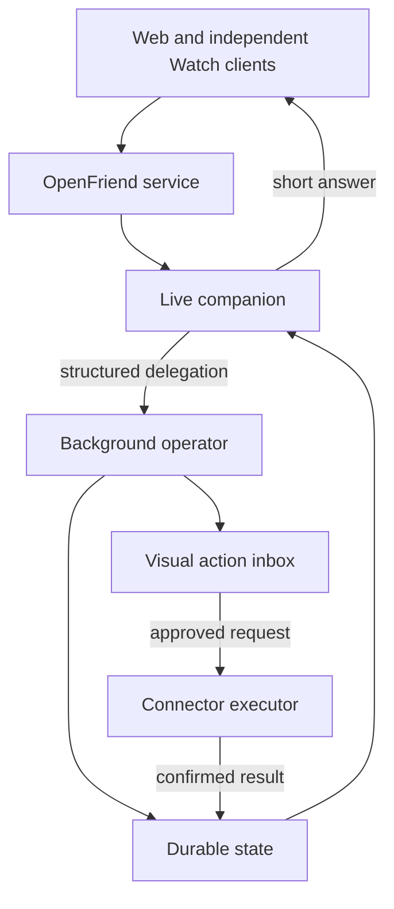

# Architecture

## System shape

OpenFriend separates the latency-sensitive conversation from slower or
consequential work.



### Live companion

Owns audio transport, full-duplex timing, interruptions, listening, speaking,
short conversational responses, and the decision to delegate. It must remain
responsive while delegated work is pending.

Phase 1 uses the OpenAI Realtime API through the official Agents SDK in the
browser. The boundary may later host GPT-Live or another live provider, but
Phase 0 defines only the two model profiles needed now.

### Background operator

Owns deeper reasoning, persistent jobs, integrations, and action execution. It
accepts structured work, emits durable status, and returns a result to the live
companion or dashboard. A Pi-backed implementation is a later bounded
evaluation, not a Phase 0 dependency.

## Repository shape

```text
apps/
  web/                  Next.js voice lab and dashboard
apps/watch/             Independent SwiftUI app beginning in Phase 2
packages/
  contracts/            Framework-independent TypeScript contracts
docs/                   Versioned knowledge system and plans
scripts/                Narrow mechanical repository checks
```

Swift contracts will mirror versioned service payloads rather than importing
TypeScript. Code generation is added only if duplicated contracts become a
measured maintenance problem.

## Live-model profiles

`LiveModelProfile` is configuration for product-visible choices, not a general
provider framework. Phase 0 needs:

- stable profile ID;
- provider and provider model ID;
- display name and description;
- relative cost/quality tier;
- full-duplex audio, interruption, and tool-use capabilities.

Initial profiles:

- Economy → `gpt-realtime-2.1-mini`
- Quality → `gpt-realtime-2.1`

The deprecated `gpt-realtime-mini` identifier is prohibited. Switching profile
starts a new live session. The background operator model is configured
separately.

## Data direction

Supabase will provide Postgres, Auth, and Storage when a story first needs
durable data. Even for the personal-first product, durable rows carry explicit
user ownership.

Expected early domains are conversations, transcript items, journal entries,
memory candidates, accepted memories, tasks, delegated jobs, proposed actions,
approval decisions, execution attempts, and session evaluation metrics. These
are a direction, not permission to create Phase 0 tables.

## Action lifecycle

Consequential actions follow:

```text
proposed -> awaiting_approval -> executing -> completed
                                      |       failed
                                      |       cancelled
                                      └-----> uncertain
```

Every external write receives a stable idempotency identifier. `completed`
requires confirmation from the source system. An uncertain result stops for
review rather than retrying blindly.

## Deployment direction

- Vercel hosts the Next.js web and server surface.
- Supabase owns durable app data.
- Stripe Projects provisions and synchronizes supported project services.
- OpenAI credentials remain server-side and enter environments through a
  secret manager, never source control.

All resources belong to Andrew's personal accounts. See
[ENGINEERING.md](ENGINEERING.md) and [SECURITY.md](SECURITY.md).
