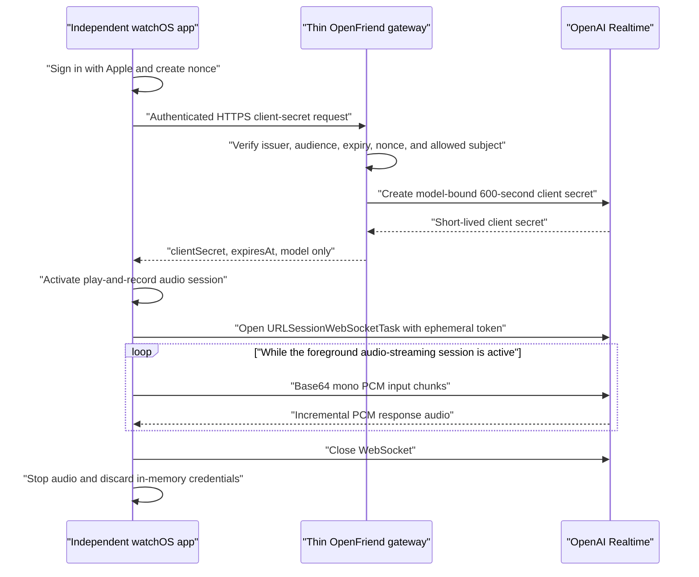

# Phase 2 Phone-Free Watch Conversation Design

**Date:** 2026-07-27

**Status:** Recommended for acceptance; implementation has not begun

**Story:** [Talk without the phone](../USER_STORIES.md#talk-without-the-phone)

## Goal

Let Andrew start, interrupt, and end a useful Realtime conversation from an
independent Apple Watch over Wi-Fi or cellular without using the paired iPhone
as the data path.

The first vertical slice remains a full-duplex companion. It is not
record-then-submit audio, a push-to-talk command parser, a transcript product,
or an operator workflow.

## Decision

Use this Phase 2 baseline:



The Watch talks directly to OpenAI only after the gateway authenticates the
single accepted user and mints a short-lived Realtime client secret. The
permanent OpenAI API key, Apple subject allowlist, and safety-identifier key
remain server-side.

Use `URLSessionWebSocketTask`, `AVAudioSession`, `AVAudioEngine`,
`AVAudioConverter`, and `AVAudioPlayerNode`. Do not add Supabase, a durable
transcript, a persistent socket relay, a queue, or a new hosting provider for
this slice.

This is a conditional recommendation. It becomes the accepted implementation
path only after a signed physical-Watch spike proves that an active
play-and-record session unlocks the WebSocket and supports simultaneous capture
and playback over both Wi-Fi and Watch cellular.

## Why this is the narrowest viable path

The existing Watch target is already watch-only. Apple documents that an
independent watchOS app must download data and authenticate without relying on
Watch Connectivity as its main data path.

Apple also classifies `URLSessionWebSocketTask` as low-level networking on
watchOS. [TN3135](https://developer.apple.com/documentation/technotes/tn3135-low-level-networking-on-watchos)
allows low-level networking for an audio-streaming app only while it is
actively streaming audio. Apple's
[watchOS audio-streaming session](https://developer.apple.com/videos/play/wwdc2019/716/)
states that the app must gather any initial metadata first, activate its audio
session, and only then open its WebSocket. The simulator does not enforce the
same restriction, so it cannot prove feasibility.

OpenAI's
[Realtime WebSocket guide](https://developers.openai.com/api/docs/guides/realtime-websocket)
documents ephemeral-token WebSocket authentication and the raw event
transport. OpenAI recommends WebRTC for browser and mobile clients in most
cases, but watchOS does not provide a public native WebRTC API and OpenAI does
not provide a Swift/watchOS Realtime SDK. A direct WebSocket therefore uses
supported public APIs on both sides while avoiding a custom media dependency.

The cost is deliberate: OpenFriend must own PCM conversion, playback
buffering, backpressure, reconnect behavior, and interruption truncation on the
Watch. Those responsibilities are included in the first slice rather than
hidden behind a later promise.

## Alternatives

| Approach                                                 | Strengths                                                                                          | Costs and risks                                                                                                                                                                            | Phase 2 decision                                                                                  |
| -------------------------------------------------------- | -------------------------------------------------------------------------------------------------- | ------------------------------------------------------------------------------------------------------------------------------------------------------------------------------------------ | ------------------------------------------------------------------------------------------------- |
| Watch to OpenAI WebSocket after gateway mint             | One streaming hop; no long-lived provider key on Watch; public Foundation API; no new socket host  | OpenAI generally prefers WebRTC for mobile; Apple permits the socket only during active audio streaming; OpenFriend owns PCM, jitter, and truncation; physical-device proof is mandatory   | **Recommended conditional baseline**                                                              |
| Watch to persistent OpenFriend relay to OpenAI WebSocket | Server can mediate protocol, enforce central limits, and hide OpenAI events                        | Adds a second audio hop, latency, operating cost, audio exposure, a stateful socket service, and another failure domain; does not remove Apple's Watch-side low-level-networking rule      | Fallback only if direct OpenAI authentication or protocol behavior fails a measured hardware gate |
| Native Watch WebRTC                                      | Matches OpenAI's preferred client transport and delegates media buffering and truncation to WebRTC | No public native watchOS WebRTC framework or official OpenAI Swift/watchOS SDK was established; would require a third-party native port, signaling, binary-size, battery, and signing work | Defer; reconsider only after a bounded hardware spike and a clear advantage over WebSocket        |

A relay is not a default recovery plan for weak Watch networking. The Watch
would still need a low-level connection to the relay, so the active-audio
constraint remains. Adopt a relay only when evidence shows that server
mediation solves a specific failure that the direct path cannot.

## Scope

### Included

- one independent watch-only app;
- one accepted user and one server-selected Economy profile;
- Sign in with Apple authentication at the gateway;
- a short-lived, model-bound OpenAI Realtime client secret;
- one active, in-memory Realtime session;
- simultaneous PCM microphone capture and response playback;
- server VAD, natural barge-in, and a visible manual stop-speaking action;
- client-managed WebSocket interruption truncation;
- one bounded reconnect with a new client secret;
- explicit audio interruption, route loss, device lock, and connection failure
  states;
- signed physical-device proof on Wi-Fi and Watch cellular without the phone;
- session-only diagnostics without transcript or audio retention.

### Excluded

- Watch Connectivity as a required data path;
- Supabase, database rows, object storage, analytics, or transcript persistence;
- background operator work, tools, memory, tasks, drafts, or web handoff;
- Quality/Economy comparison on Watch;
- silent indefinite reconnection or cross-session conversation restoration;
- a custom WebRTC stack, third-party media engine, or persistent backend relay;
- App Attest, refresh tokens, or general multi-user auth in the first slice;
- App Store submission or a production availability claim.

## Authentication and gateway boundary

### Watch authentication

Apple's
[Watch authentication guidance](https://developer.apple.com/documentation/watchos-apps/authenticating-users-on-apple-watch)
requires an independent app to sign in without depending on the iPhone and
identifies Sign in with Apple as the supported account path.

For the single-user Phase 2 slice:

1. The Watch creates a cryptographically random nonce in memory.
2. Sign in with Apple binds the nonce hash to the returned identity token.
3. The Watch sends the identity token as a bearer credential and the raw nonce
   over HTTPS to the OpenFriend gateway.
4. The gateway verifies Apple's signature and the expected issuer, audience,
   expiration, nonce, and configured allowed subject.
5. The gateway derives a stable, privacy-preserving OpenAI safety identifier
   from the verified subject with a server-side keyed hash.
6. The gateway mints and returns a Realtime client secret.
7. The Watch retains the Apple identity token and Realtime secret in memory
   only for the active session, then discards both.

The gateway never requests or stores the user's name or email. The Apple
subject, audience, and keyed-hash secret live only in an approved personal
secret store. No populated value belongs in Git, documentation, logs, test
fixtures, screenshots, or provider output.

The identity token may be reused once during its validity window to request the
single reconnect credential. If it is no longer valid, the session fails to an
honest signed-out state. Phase 2 does not add a refresh-token system or prompt
for authentication invisibly during a walk.

### Gateway contract

Add a Watch-only endpoint:

```text
POST /api/watch/realtime/client-secret
Authorization: Bearer <Sign in with Apple identity token>
X-OpenFriend-Nonce: <session nonce>
Content-Type: application/json

{}
```

Successful response:

```json
{
  "clientSecret": "<short-lived value>",
  "expiresAt": 0,
  "model": "gpt-realtime-2.1-mini"
}
```

The endpoint:

- always chooses the Economy profile server-side;
- creates a 600-second Realtime client secret;
- applies `Cache-Control: no-store`;
- returns only the three documented fields;
- rejects missing, expired, wrong-audience, wrong-nonce, or non-allowlisted
  identity tokens without revealing which check failed;
- rejects a model mismatch or malformed OpenAI response;
- never logs bearer credentials, upstream bodies, audio, transcripts, Apple
  subjects, or safety identifiers;
- remains behind the current Vercel protection until authenticated-route rate
  limiting is configured and verified.

The existing Phase 1 browser route stays behavior-compatible. A small
server-only minting helper may be shared so both routes validate the exact
upstream model and sanitize failures.

## Audio and WebSocket sequence

Apple's documented ordering is part of the contract:

1. Authenticate and fetch the Realtime client secret over ordinary HTTPS.
2. Confirm `supportsAudioStreaming` on the physical Watch.
3. Request microphone permission.
4. Configure `AVAudioSession` for play-and-record voice use.
5. Activate the audio session and wait for route selection to complete.
6. Start the capture and playback engine.
7. Create a `URLSession` configured for audio streaming.
8. Open `URLSessionWebSocketTask` to the exact returned model using the
   ephemeral token.
9. Wait for `session.created`, send the accepted `session.update`, and wait for
   `session.updated` before streaming microphone frames.
10. On End or any terminal failure, close the WebSocket, stop capture and
    playback, remove observers, deactivate audio, and erase in-memory
    credentials.

Starting the WebSocket before the audio session is active is a test failure,
even if it happens to work in the simulator.

### Input audio

The audio pipeline:

- captures the Watch input with an `AVAudioEngine` input tap;
- converts device audio to signed 16-bit, 24 kHz, mono, little-endian PCM;
- frames approximately 40 ms per `input_audio_buffer.append`;
- Base64-encodes only at the WebSocket boundary;
- bounds unsent input to 250 ms;
- drops the oldest unsent frame and reports degraded input if the bound is
  exceeded;
- never writes raw or encoded audio to disk.

The exact device input format is discovered at runtime. No implementation may
assume that Watch hardware captures at 24 kHz.

### Output audio

The output pipeline:

- decodes each `response.output_audio.delta`;
- associates it with its `item_id` and `content_index`;
- converts 24 kHz PCM to the active hardware output format;
- schedules bounded buffers on `AVAudioPlayerNode`;
- tracks samples actually rendered, not merely received or scheduled;
- caps queued, unplayed response audio at 500 ms and enters a degraded state
  instead of allowing unbounded growth;
- ignores late deltas after that response generation has been cancelled or
  truncated.

Buffer bounds are initial engineering limits, not product promises. Physical
tests may tighten them, but loosening them requires measured evidence.

### Turn creation

Preserve the Phase 1 false-turn protection:

- use server VAD with response interruption enabled;
- receive input transcription for session-only turn validation;
- request `response.create` only after a completed, non-blank user
  transcription;
- do not render or retain transcript text in the first Watch slice.

This keeps natural turn-taking without allowing an empty noise event to invent
an assistant response.

## Interruption and truncation

OpenAI's
[interruption guidance](https://developers.openai.com/api/docs/guides/realtime-conversations#interruption-and-truncation)
states that WebSocket clients manage playback and must truncate the unplayed
assistant audio themselves.

Natural barge-in and the manual stop-speaking control use the same primitive:

1. Record the active assistant `item_id`, `content_index`, and output sample
   origin.
2. On `input_audio_buffer.speech_started`, immediately stop and reset local
   playback.
3. Calculate `audio_end_ms` from samples actually rendered for that item.
4. Send exactly one `conversation.item.truncate` for the active item and
   content part.
5. Mark the response generation cancelled locally and ignore late audio.
6. Continue capturing the user's interrupting speech.

For the manual action, send `response.cancel` before the same local
stop-and-truncate operation. If no assistant audio is active, interruption is
an idempotent no-op.

Tests must prove that received, scheduled, and played duration are not
confused. Truncating at received duration would tell the model that unheard
audio was played and would break conversational continuity.

## State and failure behavior

The user-visible state machine is:

```text
idle
  -> authenticating
  -> activating_audio
  -> connecting
  -> live
  -> reconnecting -> live
  -> ended

Any nonterminal state -> failed
```

Supplemental live flags report:

- microphone sending or paused;
- assistant playing or stopped;
- Wi-Fi, cellular, or system-selected path when observable;
- degraded input or output buffering;
- reconnect used;
- audio interrupted or route lost.

The interface never claims continuous audio while watchOS has suspended the
app, the audio session is inactive, or the socket is disconnected.

### Bounded reconnect

On the first unexpected socket loss:

1. Stop playback and stop enqueuing captured audio.
2. Keep the audio session active for at most five seconds so watchOS continues
   to permit the audio-streaming connection attempt.
3. Use the still-valid in-memory Apple identity token to request one new
   Realtime client secret.
4. Create one new WebSocket and Realtime session.
5. Resume with empty conversation context and announce that continuity may be
   lost.

Do not replay captured audio, assistant audio, protocol events, or delegated
work. A failed reconnect or any second loss ends the session. A user may start
a wholly new session explicitly.

### Audio interruption and route loss

Observe audio-session interruption, route-change, and media-services-reset
notifications.

- A temporary system interruption pauses capture and playback and exposes an
  interrupted state.
- Resume only when the system recommends it and the same safe route is
  available.
- Loss of the active output route ends the Realtime session. Do not silently
  switch from headphones to the speaker during an intimate conversation.
- Media-services reset rebuilds the audio graph before any explicit new
  session; it does not silently resume the old socket.

### Device lock or loss

No bearer credential, client secret, transcript, or audio survives process
termination. Locking the Watch or removing it from the wrist must stop capture
and end the live session on physical hardware. Sign in with Apple revocation
and device passcode behavior remain Apple account and device controls; the
gateway retains no session record to delete in this slice.

## Runtime and background boundary

The first signed spike begins as a frontmost session. The Audio background mode
may be enabled only to support the accepted continuous audio-streaming story.
Do not select an unrelated `WKExtendedRuntimeSession` category to obtain more
runtime. Apple explicitly requires extended-runtime categories to match their
real use, and a live companion is not automatically a mindfulness,
self-care, physical-therapy, or smart-alarm session.

Wrist-down continuity is therefore a physical acceptance gate. If watchOS does
not continue a legitimate active play-and-record stream when the display dims,
the Phase 2 story remains unaccepted; the implementation must not fake
continuity or misuse an extended-runtime category.

## Security and privacy

- Permanent OpenAI and Apple server credentials never reach the Watch.
- Identity and Realtime bearer values are held in memory only.
- HTTPS and WSS are mandatory.
- No email, name, Apple subject, transcript, or raw audio is logged.
- Session diagnostics use random session IDs, timestamps, state transitions,
  duration, buffer depth, close category, and coarse network class only.
- The Watch endpoint is authenticated, no-store, model-bound, and rate-limited
  before any public exposure.
- The existing Vercel protection remains enabled during development.
- All Apple, Vercel, and OpenAI resources must belong to Andrew's personal
  accounts.
- Synthetic phrases are used in committed tests and public evidence.

App Attest can later add app-instance integrity, but it requires device
attestation state and server verification. It is not necessary to prove the
single-user conversation and is intentionally deferred.

## Verification gates

### Automated before hardware

- pure Swift reducer tests for every state and terminal cleanup;
- identity-verification and Watch gateway route tests;
- JSON protocol decoding and encoding tests using synthetic fixtures;
- PCM conversion tests for 48 kHz stereo/mono to 24 kHz mono PCM16;
- playback-clock and exact truncation tests;
- input/output backpressure tests;
- one-reconnect and stale-callback tests;
- simulator build and hostless Watch unit tests;
- existing browser Realtime route and `pnpm verify` remain green.

Simulator success is not evidence that the WebSocket is allowed on Watch
hardware.

### Signed physical-device feasibility gate

Before building the complete UI, prove on Andrew's personal signed Watch:

1. microphone permission and route selection succeed;
2. an active play-and-record session is established before the socket;
3. the WebSocket fails honestly when attempted without active streaming and
   succeeds when the accepted sequence is followed;
4. simultaneous capture and playback work without runaway echo;
5. natural speech stops playback and sends correct truncation;
6. End closes the socket and audio session;
7. the Watch has no durable bearer credential after termination.

If these fail, stop and record evidence before choosing a relay or WebRTC spike.

### Field matrix

The signed build must then pass:

| Condition                       | Required observation                                                                     |
| ------------------------------- | ---------------------------------------------------------------------------------------- |
| iPhone nearby                   | Start, interrupt, and End work, but no request depends on Watch Connectivity             |
| iPhone disconnected in Settings | The same session works over direct Watch networking                                      |
| Known Wi-Fi                     | Conversation remains full-duplex during normal movement                                  |
| Watch cellular                  | A walk without the phone supports a useful continuous conversation                       |
| Wrist lowered                   | State remains truthful; active audio either continues legitimately or reports suspension |
| Background noise                | Three synthetic guide turns remain usable and empty noise does not trigger a response    |
| Brief network loss              | Exactly one fresh session is attempted; no audio is replayed or duplicated               |
| Second network loss             | Session fails and cleans up                                                              |
| Bluetooth route loss            | Playback stops immediately and the session ends without speaker disclosure               |
| Audio interruption              | Capture/playback pause and resume only when the system allows                            |
| Watch locked or removed         | Capture ends and no credential remains durable                                           |

Record date, Watch model, watchOS version, network condition, expected result,
actual result, cleanup confirmation, and limitation. Do not commit recordings,
real transcripts, account identifiers, or screenshots containing private data.

## Prerequisites and stop conditions

Implementation is blocked until Andrew confirms:

- a personal Apple Developer team that may sign this Watch target;
- authority to register or adopt the Watch App ID and Sign in with Apple
  capability in that personal team;
- the exact personal Watch hardware and cellular plan for the field test;
- a personal Vercel/OpenAI development environment for the authenticated route;
- an accepted authenticated-route rate-limit mechanism that does not require
  Supabase.

Stop Phase 2 implementation if:

- provider ownership is ambiguous;
- a credential or personal identifier appears in a public diff or log;
- active audio does not unlock the WebSocket on physical hardware;
- simultaneous capture/playback is not useful;
- phone-free cellular cannot be proven;
- the only path forward requires a persistent relay, native WebRTC port, new
  database, or unrelated background-runtime category without a newly accepted
  design.

## Current primary sources

Reviewed on 2026-07-27:

### Apple

- [Creating independent watchOS apps](https://developer.apple.com/documentation/watchos-apps/creating-independent-watchos-apps/)
- [Authenticating users on Apple Watch](https://developer.apple.com/documentation/watchos-apps/authenticating-users-on-apple-watch)
- [Verifying a Sign in with Apple user](https://developer.apple.com/documentation/signinwithapple/verifying-a-user)
- [TN3135: Low-level networking on watchOS](https://developer.apple.com/documentation/technotes/tn3135-low-level-networking-on-watchos)
- [`URLSessionWebSocketTask`](https://developer.apple.com/documentation/foundation/urlsessionwebsockettask)
- [Streaming Audio on watchOS 6](https://developer.apple.com/videos/play/wwdc2019/716/)
- [`AVAudioSession`](https://developer.apple.com/documentation/avfaudio/avaudiosession)
- [`AVAudioEngine`](https://developer.apple.com/documentation/avfaudio/avaudioengine)
- [Handling audio interruptions](https://developer.apple.com/documentation/avfaudio/handling-audio-interruptions)
- [Enabling background sessions](https://developer.apple.com/documentation/watchkit/enabling-background-sessions)
- [Using extended runtime sessions](https://developer.apple.com/documentation/watchkit/using-extended-runtime-sessions)

### OpenAI

- [Realtime API with WebSocket](https://developers.openai.com/api/docs/guides/realtime-websocket)
- [Realtime API with WebRTC](https://developers.openai.com/api/docs/guides/realtime-webrtc)
- [Realtime conversations: WebSocket audio](https://developers.openai.com/api/docs/guides/realtime-conversations#handling-audio-with-websockets)
- [Realtime conversations: interruption and truncation](https://developers.openai.com/api/docs/guides/realtime-conversations#interruption-and-truncation)

## Fable review record

One bounded, read-only Claude Fable/high review was attempted on 2026-07-27.
The Claude CLI returned:

> You've reached your Fable 5 limit. Run /usage-credits to continue or switch
> models with /model.

No review ran. No other Claude model was substituted. Work continued under
Andrew's explicit prior deferral. This limitation is not architecture approval.

## Recommendation

Accept the direct ephemeral-token WebSocket design as the Phase 2 implementation
candidate, then begin with the signed physical-device feasibility gate. It is
the smallest design that preserves full duplex, interruption, credential
isolation, phone-free networking, and public-repository safety.

Do not approve a relay, Supabase, native WebRTC dependency, or Phase 2
completion until physical evidence shows that the direct path fails a specific
accepted criterion or the complete field matrix passes.
