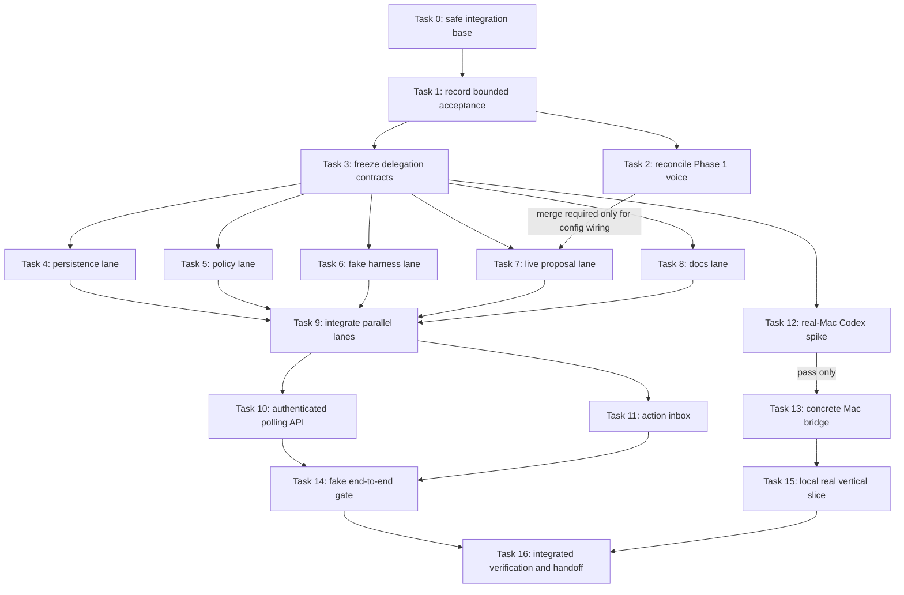

# Friend Gateway Control Plane Implementation Plan

> **For Claude:** REQUIRED SUB-SKILL: Use superpowers:executing-plans to implement this plan task-by-task.

**Goal:** Build and verify the smallest durable OpenFriend path from a realtime job proposal to an authenticated, approval-aware Codex job on one paired Mac, while keeping the live Friend responsive and every external-effect claim truthful.

**Architecture:** OpenFriend remains a modular monolith on the current Next.js/Vercel and Supabase stack. Capable clients connect directly to the Realtime provider; deterministic server code turns a proposal into a durable job and exposes short authenticated HTTPS polling routes to one Codex-on-Mac bridge. The first implementation is singular and concrete—Codex app-server only—with no generic executor interface, queue vendor, hosted sandbox, or server-held WebSocket.

**Tech Stack:** TypeScript, Next.js App Router, React, Vitest, Supabase Postgres/Auth, OpenAI Realtime, Codex app-server JSON-RPC, macOS Keychain, pnpm workspaces.

---

## 1. Authority, scope, and finish line

Andrew approved the Friend Gateway design and requested autonomous continued
implementation on 2026-07-31. For this plan, that authorizes these bounded
story slices once Task 1 records them in `docs/USER_STORIES.md`:

- `OF-101`: integrate the already-built Phase 1 web conversation only after its
  branch passes review and the repository gate;
- `OF-401`: implement contracts, durable jobs, a fake bridge/app-server harness,
  a benign real-Mac app-server spike, and—only after that spike passes—the
  smallest Codex-on-Mac bridge vertical slice;
- `OF-402`: implement exact-proposal approval, expiry, revocation, uncertainty,
  and source-confirmation invariants with synthetic evidence; do not perform a
  consequential external write.

The following remain out of scope and must not appear in production code:

- relationship-memory tables or automatic transcript/Codex-output ingestion;
- a second executor, executor registry, provider enum, A2A, Hermes, Claude, or
  OpenClaw adapter;
- Watch implementation or modification of any Watch worktree;
- a native iPhone or Mac conversation app;
- a hosted sandbox, queue vendor, scheduled correctness job, or long-lived
  Vercel socket;
- unattended sending, publishing, purchasing, deleting, pushing, merging,
  releasing, credential changes, or security-setting changes.

The plan's primary finish line is a local integrated test proving:

```text
live delegate proposal
  -> authenticated durable job
  -> exact approval when required
  -> authenticated Mac poll/lease
  -> Codex app-server turn or fake equivalent
  -> idempotent progress events
  -> confirmed result or explicit uncertainty
  -> Friend/action-inbox status
```

Physical Watch acceptance, production deployment, and a consequential real
account action are not finish criteria.

## 2. Fable/high corrections incorporated

A read-only Fable/high review completed on 2026-07-31. This plan incorporates
its required corrections:

1. The bridge uses short authenticated HTTPS polls. Supabase Realtime may later
   wake the bridge, but correctness never depends on it.
2. Vercel functions hold no persistent connection or correctness-critical
   in-memory state. Offline/timeout presentation is derived lazily from durable
   timestamps.
3. The browser connects directly to OpenAI Realtime using the existing
   server-minted client-secret route. “Server control” means deterministic
   session configuration and authenticated handling of job proposals, not a
   server-held media socket.
4. The v1 Codex integration is concrete. Do not create `Executor`,
   `OperatorProvider`, adapter registries, or provider-discriminator columns.
5. Friend identity is a config-backed stable ID in this slice. Candidate memory
   stories do not authorize memory tables.
6. Human and device principals are distinct. Only a human principal can create
   an approval decision; every device request rechecks revocation.
7. A real bridge is gated behind the real-Mac app-server spike. Failure of that
   lane does not block completion of the fake-backed control plane.

## 3. Orchestrator operating contract

Use @superpowers:using-git-worktrees before implementation and
@superpowers:subagent-driven-development when delegating tasks. Each worker
task must state its goal, owned paths, forbidden paths, required tests, expected
commit, return summary, and stop condition. Do not create recursive delegation
loops. The primary orchestrator is the only integration owner.

### Worktree and file ownership

| Lane          |         Tasks | Exclusive paths                                                                      |
| ------------- | ------------: | ------------------------------------------------------------------------------------ |
| Integration   | 0–2, 9, 14–16 | root manifests, canonical-doc snapshot, cherry-picks, integrated gate                |
| Contracts     |             3 | `packages/contracts/src/delegation*`, `packages/contracts/src/index.ts`              |
| Persistence   |             4 | `supabase/migrations/**`, `apps/web/lib/delegation/*repository*`                     |
| Policy        |             5 | `apps/web/lib/delegation/approval*`, `principal*`, `job-service*`                    |
| Fake harness  |             6 | `apps/web/tests/delegation/**`                                                       |
| Live proposal |             7 | `apps/web/lib/live-delegation*`, tests, and `apps/web/lib/live-agent-config.ts`      |
| Documentation |             8 | named docs plus `scripts/check-docs.test.mjs`                                        |
| API           |            10 | `apps/web/app/api/delegation/**`, `apps/web/lib/auth/**`, `apps/web/lib/supabase/**` |
| Inbox UI      |            11 | `apps/web/components/action-inbox*` only                                             |
| Mac spike     |            12 | `scripts/spikes/**`, `docs/evidence/**`                                              |
| Mac bridge    |            13 | `apps/mac-bridge/**` only; conditional                                               |

No worker may touch `.worktrees/phase1-live-conversation`,
`.worktrees/phase2-task2a-physical`, `apps/watch`, root manifests, or another
lane's files. The integration owner performs all root-manifest changes before
fan-out and all cherry-picks after workers stop.

### Autonomous continuation and stop rules

- Continue without asking Andrew for local code edits, focused tests, local
  synthetic services, documentation, narrow commits, or read-only inspection.
- If a lane fails, use @superpowers:systematic-debugging for at most three
  evidence-based fix attempts. Then park only that lane, record the blocker,
  and advance every independent lane.
- Rebase or replay a worker only through the integration owner. Never resolve a
  cross-lane contract conflict by silently editing the frozen contract.
- Stop the whole run immediately for suspected secret exposure, ambiguous
  provider-account ownership, a required destructive operation, a request for
  a consequential external write, or a required macOS security permission that
  was not already granted.
- A billable Realtime or Codex session must be closed in `finally`; media tracks
  and child processes must be stopped and verified. Follow `docs/TESTING.md`.
- Do not deploy, push, open a PR, merge, enable automatic Codex review, change
  signing, or apply a production migration unless Andrew separately asks.
- Never mark `OF-401`, `OF-402`, or a hardware criterion Completed from fake,
  simulator, preflight, or schema evidence.

## 4. Dependency graph and parallel schedule



Tasks 4–8 are the main parallel fan-out. Task 12 can run beside them after the
contract is frozen. Task 13 is conditional; if Task 12 blocks, skip Tasks 13
and 15, finish the fake-backed control plane, and document the precise blocker.

---

## Phase 0: Establish one safe integration base

### Task 0: Audit and create the integration worktree

**Files:**

- Inspect only: repository root and all registered worktrees
- Do not modify: existing dirty root or legacy worker worktrees

**Step 1: Inspect repository state**

Run:

```bash
git status --short
git worktree list --porcelain
git branch --show-current
```

Expected: all dirty paths and every existing worker are visible. Record the
current branch and HEAD in the orchestration log.

**Step 2: Verify the plan branch**

Run:

```bash
git show andrew/friend-gateway-plan:docs/plans/2026-07-31-friend-gateway-control-plane-implementation.md >/dev/null
```

Expected: exit 0.

**Step 3: Create the integration worktree**

Use @superpowers:using-git-worktrees. Create it from the branch containing this
plan, never from a dirty working tree:

```bash
git -C /Users/andrewsiah/Documents/openfriend worktree add .worktrees/friend-gateway-integration -b andrew/friend-gateway-integration andrew/friend-gateway-plan
```

Expected: a clean worktree on `andrew/friend-gateway-integration`.

**Step 4: Snapshot the reviewed dirty-root documentation without modifying it**

The approved Codex-on-Mac story registry and active delivery plans currently
exist as uncommitted user work in `/Users/andrewsiah/Documents/openfriend`, not
at the plan branch's starting commit. Preserve that work before Task 1.

Read the source and destination versions, then use `apply_patch` in the clean
integration worktree to reproduce the source contents exactly for these paths:

```text
AGENTS.md
README.md
docs/README.md
docs/ARCHITECTURE.md
docs/ENGINEERING.md
docs/INFRASTRUCTURE.md
docs/PLANS.md
docs/PRODUCT.md
docs/QUALITY_SCORE.md
docs/RELIABILITY.md
docs/SECURITY.md
docs/TESTING.md
docs/USER_STORIES.md
docs/plans/2026-07-26-openfriend-foundation-design.md
docs/plans/2026-07-26-phase-0-foundation.md
docs/plans/2026-07-26-voice-first-product-focus-design.md
docs/plans/2026-07-27-codex-on-mac-delegation-design.md
docs/plans/2026-07-28-parallel-mac-bridge-and-watch-delivery.md
```

Do not copy `apps/watch`, its Xcode scheme, `design-explorations`, `.env` files,
generated output, or any other dirty-root path. Do not edit, stage, stash, or
commit the source checkout. If the source checkout no longer contains these
changes, inspect branches and commits for the same reviewed text; do not invent
missing story sections.

Verify the snapshot before committing:

```bash
rg -n "OF-401|OF-402|Codex on Mac" docs/USER_STORIES.md
test -f docs/plans/2026-07-27-codex-on-mac-delegation-design.md
test -f docs/plans/2026-07-28-parallel-mac-bridge-and-watch-delivery.md
git diff --check
node scripts/check-docs.mjs
```

Expected: the story IDs and both plans exist; diff and docs checks pass. Inspect
the full diff for secrets and unrelated personal data, then commit only the
listed paths:

```bash
git add AGENTS.md README.md docs
git commit -m "docs: preserve current OpenFriend architecture"
```

**Step 5: Install and verify the baseline**

Run:

```bash
pnpm install --frozen-lockfile
node --test scripts/check-docs.test.mjs
node scripts/check-docs.mjs
```

Expected: install completes, 3 documentation tests pass, and the documentation
check passes. If registry metadata retries block install, record that exact
environmental blocker, run the two direct Node checks, and continue planning or
docs work only until dependencies are available.

**Step 6: Commit only if setup required an intentional repository fix**

Do not commit generated dependencies. If no repository file changed, make no
commit.

### Task 1: Record the accepted story slices and serverless transport decision

**Files:**

- Modify: `docs/USER_STORIES.md`
- Modify: `docs/ARCHITECTURE.md`
- Modify: `docs/INFRASTRUCTURE.md`
- Modify: `docs/PLANS.md`
- Reference: `docs/plans/2026-07-31-friend-gateway-design.md`

**Step 1: Write the documentation assertion first**

Add a test case to `scripts/check-docs.test.mjs` that copies the documentation
fixture and asserts the plans index must link to the new approved design and
implementation plan.

**Step 2: Run the test to verify it fails**

Run:

```bash
node --test scripts/check-docs.test.mjs
```

Expected: FAIL because the fixture/index lacks the Friend Gateway plan link.

**Step 3: Make the minimum documentation change**

- Change `OF-101`, `OF-401`, and `OF-402` to `Accepted`.
- Add a dated note under each: implementation remains criterion-ordered; real
  bridge work follows the app-server spike; synthetic approval evidence cannot
  establish external completion.
- Replace “persistent outbound connection” language with authenticated outbound
  HTTPS polling backed by durable state.
- State explicitly that the gateway is initially stateless service modules, not
  a new daemon.
- Link the approved design and this plan from `docs/PLANS.md`.

Do not change `OF-201`–`OF-203` or `OF-301`–`OF-302` status.

**Step 4: Run documentation checks**

Run:

```bash
node --test scripts/check-docs.test.mjs
node scripts/check-docs.mjs
pnpm exec prettier --check docs/USER_STORIES.md docs/ARCHITECTURE.md docs/INFRASTRUCTURE.md docs/PLANS.md scripts/check-docs.test.mjs
```

Expected: PASS.

**Step 5: Commit**

```bash
git add docs/USER_STORIES.md docs/ARCHITECTURE.md docs/INFRASTRUCTURE.md docs/PLANS.md scripts/check-docs.test.mjs
git commit -m "docs: accept bounded friend gateway delivery"
```

### Task 2: Reconcile the existing Phase 1 voice branch

**Files:**

- Review: branch `andrew/phase1-live-conversation`
- Review: `.worktrees/phase1-live-conversation/apps/web/**`
- Modify: integration worktree only through cherry-pick or a reviewed merge

**Step 1: Inspect the exact commit series**

Run:

```bash
git log --oneline --reverse 4fd9280..andrew/phase1-live-conversation
git diff --stat 4fd9280..andrew/phase1-live-conversation
git diff --check 4fd9280..andrew/phase1-live-conversation
```

Expected: the series ends at `25ab8c7`; `git diff --check` is clean.

**Step 2: Run the branch's focused gate without editing it**

Running `pnpm install --frozen-lockfile` in that existing worktree is allowed if
its dependencies are absent; do not stage or commit dependency artifacts there.

Run in `.worktrees/phase1-live-conversation`:

```bash
pnpm --filter @openfriend/web test
pnpm --filter @openfriend/web typecheck
pnpm --filter @openfriend/web lint
pnpm --filter @openfriend/web build
```

Expected: PASS. Ensure the test teardown closes the Realtime session and stops
tracks. Do not open a billable live session.

**Step 3: Review lifecycle and secret boundaries**

Verify tests cover stale callbacks, reconnect failure, exact model selection,
no idle client-secret minting, session close, microphone-track stop, and audio
playback teardown. Inspect the complete diff for secrets and populated account
data.

**Step 4: Integrate the branch**

If the review and gate pass:

```bash
git merge --no-ff andrew/phase1-live-conversation -m "merge: integrate accepted web conversation"
```

If the merge conflicts with Task 1 documentation, preserve Task 1's current
architecture/story wording and take the Phase 1 code/tests. Never edit the
source worktree.

**Step 5: Re-run the focused gate**

Run the same four commands in the integration worktree. Expected: PASS.

---

## Phase 1: Freeze the contract, then fan out

### Task 3: Add the minimal delegation contract

**Files:**

- Create: `packages/contracts/src/delegation.ts`
- Create: `packages/contracts/src/delegation.test.ts`
- Modify: `packages/contracts/src/index.ts`

Use @superpowers:test-driven-development.

**Step 1: Write failing transition and confirmation tests**

Start with:

```ts
import { describe, expect, it } from "vitest";

import {
  assertJobTransition,
  validateCompletedJob,
  type DelegatedJob,
} from "./delegation";

describe("delegated job contract", () => {
  it("allows a proposed routine job to queue", () => {
    expect(() => assertJobTransition("proposed", "queued")).not.toThrow();
  });

  it("rejects completion directly from queued", () => {
    expect(() => assertJobTransition("queued", "completed")).toThrow(
      "Illegal delegated job transition: queued -> completed",
    );
  });

  it("requires a confirmation reference for completion", () => {
    const job = { state: "completed", confirmationRef: null } as DelegatedJob;
    expect(() => validateCompletedJob(job)).toThrow(
      "Completed jobs require a confirmation reference",
    );
  });
});
```

**Step 2: Run the test to verify it fails**

```bash
pnpm --filter @openfriend/contracts test -- delegation.test.ts
```

Expected: FAIL because `./delegation` does not exist.

**Step 3: Implement the minimum contract**

The file must export only these product concepts:

```ts
export const JOB_STATES = [
  "proposed",
  "awaiting_approval",
  "queued",
  "running",
  "completed",
  "failed",
  "cancelled",
  "uncertain",
  "mac_offline",
  "codex_unavailable",
] as const;

export type JobState = (typeof JOB_STATES)[number];
export type PermissionProfile = "routine" | "requires_approval";

export type DelegatedJob = Readonly<{
  id: string;
  ownerId: string;
  idempotencyKey: string;
  goal: string;
  expectedDeliverable: string;
  workspace: string;
  contextRefs: readonly string[];
  permissionProfile: PermissionProfile;
  stopConditions: readonly string[];
  state: JobState;
  pairedDeviceId: string | null;
  confirmationRef: string | null;
  createdAt: string;
  updatedAt: string;
}>;

export type BridgeEventType =
  | "accepted"
  | "delivered"
  | "started"
  | "status"
  | "approval_request"
  | "result"
  | "cancelled"
  | "error";

export type BridgeEvent = Readonly<{
  jobId: string;
  seq: number;
  type: BridgeEventType;
  occurredAt: string;
  payload: Readonly<Record<string, unknown>>;
}>;

export type ApprovalRequest = Readonly<{
  id: string;
  jobId: string;
  proposal: string;
  proposalHash: string;
  expiresAt: string;
}>;

export type ApprovalDecision = Readonly<{
  requestId: string;
  humanPrincipalId: string;
  proposalHash: string;
  decision: "approved" | "rejected";
  decidedAt: string;
}>;
```

Add a literal legal-transition map. Include tests for every state, every legal
edge, and representative illegal edges. Do not add a capability grammar,
executor type, provider field, memory payload, Swift mirror, or code generator.

**Step 4: Run the focused gate**

```bash
pnpm --filter @openfriend/contracts test
pnpm --filter @openfriend/contracts typecheck
```

Expected: PASS.

**Step 5: Commit and freeze**

```bash
git add packages/contracts/src/delegation.ts packages/contracts/src/delegation.test.ts packages/contracts/src/index.ts
git commit -m "feat: define durable delegation contract"
```

The integration owner tags the SHA in the orchestration log. Every parallel
lane starts from this commit. Contract changes after fan-out stop affected lanes
and return to the integration owner.

### Task 4: Add durable Postgres storage and repository behavior

**Files:**

- Create: `supabase/migrations/202607310001_friend_gateway.sql`
- Create: `apps/web/lib/delegation/job-repository.ts`
- Create: `apps/web/lib/delegation/job-repository.test.ts`
- Create: `apps/web/lib/delegation/supabase-job-repository.ts`
- Create: `apps/web/lib/delegation/supabase-job-repository.test.ts`

Use @sp-supabase. Use @stripe-projects-cli only to verify that any provider
target is Andrew's personal `openfriend` project. Do not apply a production
migration in this task.

**Step 1: Write failing repository contract tests**

Test that:

- `(ownerId, idempotencyKey)` returns the original job rather than duplicating;
- `(jobId, seq)` makes duplicate bridge events a no-op;
- a revoked device cannot claim work;
- two concurrent claims return one lease winner;
- `mac_offline` and `codex_unavailable` are derived from timestamps without
  persisting a scheduler transition;
- delegated context contains references only and no memory body.

**Step 2: Run the focused test and confirm RED**

```bash
pnpm --filter @openfriend/web test -- job-repository.test.ts
```

Expected: FAIL because the repository does not exist.

**Step 3: Define the repository port for storage, not executors**

```ts
export interface JobRepository {
  createOrGet(job: DelegatedJob): Promise<DelegatedJob>;
  getForOwner(ownerId: string, jobId: string): Promise<DelegatedJob | null>;
  claimNext(deviceId: string, now: Date): Promise<DelegatedJob | null>;
  appendBridgeEvent(event: BridgeEvent): Promise<"inserted" | "duplicate">;
  saveApprovalRequest(request: ApprovalRequest): Promise<void>;
  saveApprovalDecision(decision: ApprovalDecision): Promise<void>;
}
```

This is a persistence port, not a generic executor interface.

**Step 4: Add the migration**

Create tables for `paired_devices`, `delegated_jobs`, `bridge_events`,
`approval_requests`, and `approval_decisions`. Requirements:

- primary keys and owner/device foreign keys;
- unique `(owner_id, idempotency_key)` and `(job_id, seq)` constraints;
- hashed device credential only;
- lease owner and lease expiry fields on jobs;
- proposal hash and expiry on approvals;
- a check constraint for the ten job states;
- RLS enabled with no client-side write policy;
- one `security definer` claim function using `FOR UPDATE SKIP LOCKED`, with a
  fixed `search_path` and execute permission withheld from public roles.

Never place a credential, email, workspace path, or production payload in SQL.

**Step 5: Implement the Supabase adapter**

Accept a small injected query client in tests. Map database snake case to the
contract in one place. Do not import the adapter into client components.

**Step 6: Run the focused gate**

```bash
pnpm --filter @openfriend/web test -- job-repository
pnpm --filter @openfriend/web typecheck
```

Expected: PASS.

**Step 7: Commit**

```bash
git add supabase/migrations/202607310001_friend_gateway.sql apps/web/lib/delegation/job-repository.ts apps/web/lib/delegation/job-repository.test.ts apps/web/lib/delegation/supabase-job-repository.ts apps/web/lib/delegation/supabase-job-repository.test.ts
git commit -m "feat: persist idempotent delegated jobs"
```

### Task 5: Implement deterministic approval and principal policy

**Files:**

- Create: `apps/web/lib/delegation/principal.ts`
- Create: `apps/web/lib/delegation/approval-policy.ts`
- Create: `apps/web/lib/delegation/approval-policy.test.ts`
- Create: `apps/web/lib/delegation/job-service.ts`
- Create: `apps/web/lib/delegation/job-service.test.ts`

**Step 1: Write failing security tests**

Cover:

```ts
it("rejects an approval decision from a device principal");
it("rejects an approval when the proposal hash changed");
it("rejects an expired approval");
it("never treats pairing as consequential-action approval");
it("requires confirmation before completed");
it("places an unconfirmed external write in uncertain");
```

**Step 2: Run RED**

```bash
pnpm --filter @openfriend/web test -- approval-policy.test.ts job-service.test.ts
```

Expected: FAIL with missing modules.

**Step 3: Implement principals and exact-proposal hashing**

```ts
export type HumanPrincipal = Readonly<{
  kind: "human";
  ownerId: string;
  principalId: string;
}>;

export type DevicePrincipal = Readonly<{
  kind: "device";
  ownerId: string;
  deviceId: string;
}>;

export type RequestPrincipal = HumanPrincipal | DevicePrincipal;
```

Use SHA-256 over a stable UTF-8 serialization of the exact action proposal.
Only `HumanPrincipal` is accepted by `decideApproval`. Recheck expiry and hash
at decision time and again before delivery.

**Step 4: Implement the smallest job service**

It validates proposal fields, strips unapproved context bodies, chooses
`awaiting_approval` or `queued`, persists idempotently, enforces legal
transitions, and requires a confirmation reference for `completed`.

**Step 5: Run GREEN**

```bash
pnpm --filter @openfriend/web test -- approval-policy.test.ts job-service.test.ts
pnpm --filter @openfriend/web typecheck
```

Expected: PASS.

**Step 6: Commit**

```bash
git add apps/web/lib/delegation/principal.ts apps/web/lib/delegation/approval-policy.ts apps/web/lib/delegation/approval-policy.test.ts apps/web/lib/delegation/job-service.ts apps/web/lib/delegation/job-service.test.ts
git commit -m "feat: enforce exact delegated-job approvals"
```

### Task 6: Build the fake Mac and Codex harness

**Files:**

- Create: `apps/web/tests/delegation/fake-codex-app-server.ts`
- Create: `apps/web/tests/delegation/fake-mac-bridge.ts`
- Create: `apps/web/tests/delegation/scenarios.ts`
- Create: `apps/web/tests/delegation/scenarios.test.ts`

**Step 1: Write failing scenario tests**

Cover routine completion, approval pause/resume, cancellation, duplicate event
redelivery, reconnect after lease expiry, Codex unavailable, Mac offline, and an
uncertain external write. Assert the fake process is stopped in `afterEach`.

**Step 2: Run RED**

```bash
pnpm --filter @openfriend/web test -- tests/delegation/scenarios.test.ts
```

Expected: FAIL with missing fake harness modules.

**Step 3: Implement the fake app-server**

Implement only the JSON-RPC-shaped messages required by the scenarios:

```ts
type FakeCodexEvent =
  | { type: "thread.started"; threadId: string }
  | { type: "turn.started"; turnId: string }
  | { type: "turn.status"; message: string }
  | { type: "turn.approval_required"; proposal: string }
  | { type: "turn.completed"; confirmationRef: string }
  | { type: "turn.failed"; message: string };
```

This is test data, not a new OpenFriend executor protocol.

**Step 4: Implement the fake bridge**

Poll through an injected gateway client, acknowledge leases, translate fake
Codex events into `BridgeEvent`, and retry only idempotent delivery. Never retry
an uncertain external write.

**Step 5: Run GREEN and teardown checks**

```bash
pnpm --filter @openfriend/web test -- tests/delegation/scenarios.test.ts
```

Expected: PASS with no open handle warning.

**Step 6: Commit**

```bash
git add apps/web/tests/delegation
git commit -m "test: model Mac delegation failure modes"
```

### Task 7: Add the live-plane proposal boundary

**Files:**

- Create: `apps/web/lib/live-delegation-tool.ts`
- Create: `apps/web/lib/live-delegation-tool.test.ts`
- Modify only after Phase 1 merge: `apps/web/lib/live-agent-config.ts`

**Step 1: Write failing proposal tests**

Test that the live tool:

- returns a proposal, never a started/completed claim;
- requires goal, expected deliverable, workspace, and stop conditions;
- defaults context to an empty reference list;
- cannot include shell commands, credentials, or memory bodies;
- returns `awaiting_review` for consequential language.

**Step 2: Run RED**

```bash
pnpm --filter @openfriend/web test -- live-delegation-tool.test.ts
```

Expected: FAIL because the module does not exist.

**Step 3: Implement the proposal handler**

```ts
export type DelegateJobProposal = Readonly<{
  goal: string;
  expectedDeliverable: string;
  workspace: string;
  contextRefs: readonly string[];
  permissionProfile: "routine" | "requires_approval";
  stopConditions: readonly string[];
}>;

export function proposeDelegatedJob(input: unknown): Readonly<{
  status: "proposed" | "awaiting_review";
  proposal: DelegateJobProposal;
}>;
```

Do not call a bridge, Codex, Supabase, or a job route from this pure handler.

**Step 4: Add the tool description to live agent configuration**

The description must say that OpenFriend will review and queue the proposal and
that the tool result is not evidence the task ran.

**Step 5: Run GREEN**

```bash
pnpm --filter @openfriend/web test -- live-delegation-tool.test.ts
pnpm --filter @openfriend/web typecheck
```

Expected: PASS.

**Step 6: Commit**

```bash
git add apps/web/lib/live-delegation-tool.ts apps/web/lib/live-delegation-tool.test.ts apps/web/lib/live-agent-config.ts
git commit -m "feat: bound realtime job proposals"
```

### Task 8: Align the system-of-record documentation

**Files:**

- Modify: `docs/ARCHITECTURE.md`
- Modify: `docs/PRODUCT.md`
- Modify: `docs/INFRASTRUCTURE.md`
- Modify: `docs/SECURITY.md`
- Modify: `docs/RELIABILITY.md`
- Modify: `docs/TESTING.md`
- Modify: `docs/QUALITY_SCORE.md`
- Modify: `docs/plans/2026-07-27-codex-on-mac-delegation-design.md`
- Modify: `docs/plans/2026-07-28-parallel-mac-bridge-and-watch-delivery.md`

**Step 1: Add a docs-check test for conflicting architecture language**

Make the fixture fail on language that claims Vercel holds the Mac bridge's
persistent WebSocket or that multiple executor adapters exist in v1.

**Step 2: Run RED**

```bash
node --test scripts/check-docs.test.mjs
```

Expected: FAIL against the old fixture wording.

**Step 3: Update the documents**

Use the approved design's diagram and terminology. Preserve historical evidence
and add supersession notes rather than rewriting completed test records. Add
the parallel lanes and gates from this plan. Explicitly distinguish synthetic,
real-Mac, and physical-Watch evidence.

**Step 4: Run GREEN**

```bash
node --test scripts/check-docs.test.mjs
node scripts/check-docs.mjs
pnpm exec prettier --check docs scripts/check-docs.test.mjs
```

Expected: PASS.

**Step 5: Commit**

```bash
git add docs scripts/check-docs.test.mjs
git commit -m "docs: align plans with friend gateway boundaries"
```

---

## Phase 2: Integrate the parallel foundation

### Task 9: Cherry-pick and run the integrated foundation gate

**Files:**

- Modify: integration branch through cherry-picks only

**Step 1: Review each worker result**

For every lane, inspect:

```bash
git show --stat --oneline <worker-sha>
git show --check <worker-sha>
```

Reject changes outside that lane's owned paths.

**Step 2: Cherry-pick in dependency order**

Pick persistence, policy, harness, live proposal, then docs. Resolve only index
exports or formatting centrally; do not redesign a worker's contract during
integration.

**Step 3: Run focused tests**

```bash
pnpm --filter @openfriend/contracts test
pnpm --filter @openfriend/web test
pnpm --filter @openfriend/contracts typecheck
pnpm --filter @openfriend/web typecheck
node scripts/check-docs.mjs
```

Expected: PASS.

**Step 4: Run secret and diff checks**

```bash
git diff --check HEAD~5..HEAD
git status --short
```

Run the repository's available secret scanner. If none is available, inspect
the complete diff for secrets, personal payloads, emails, tokens, and populated
connection strings.

**Step 5: Commit only integration-only fixes**

```bash
git add <explicit-integration-files>
git commit -m "fix: integrate friend gateway foundation"
```

Skip this commit when no integration fix was needed.

**Step 6: Add API dependencies as the integration owner**

Before delegating Task 10, run this on the integration branch:

```bash
pnpm --filter @openfriend/web add @supabase/supabase-js @supabase/ssr
git add apps/web/package.json pnpm-lock.yaml
git commit -m "build: add server-side Supabase clients"
```

Expected: only the web manifest and root lockfile change. No other worker may
modify either file while Task 10 runs.

### Task 10: Add authenticated job and bridge polling routes

**Files:**

- Create: `apps/web/lib/auth/human-principal.ts`
- Create: `apps/web/lib/auth/device-principal.ts`
- Create: `apps/web/lib/auth/principal.test.ts`
- Create: `apps/web/lib/supabase/server.ts`
- Create: `apps/web/app/api/delegation/jobs/route.ts`
- Create: `apps/web/app/api/delegation/jobs/route.test.ts`
- Create: `apps/web/app/api/delegation/jobs/[jobId]/route.ts`
- Create: `apps/web/app/api/delegation/bridge/poll/route.ts`
- Create: `apps/web/app/api/delegation/bridge/poll/route.test.ts`
- Create: `apps/web/app/api/delegation/bridge/events/route.ts`
- Create: `apps/web/app/api/delegation/bridge/events/route.test.ts`
- Create: `apps/web/app/api/delegation/approvals/[requestId]/route.ts`
- Create: `apps/web/app/api/delegation/approvals/[requestId]/route.test.ts`
- Use dependencies committed by Task 9; do not modify manifests or lockfiles

**Step 1: Write failing authentication tests**

Test missing bearer token, invalid human JWT, unknown device credential, revoked
device, wrong owner, expired lease, and a device attempting to approve. Inject
auth and repository dependencies into handler factories; do not hit a real
provider in unit tests.

**Step 2: Run RED**

```bash
pnpm --filter @openfriend/web test -- principal.test.ts route.test.ts
```

Expected: FAIL with missing modules/routes.

**Step 3: Implement server-only clients and principal resolution**

- Human bearer tokens are validated with Supabase Auth `getUser`; never trust a
  decoded but unverified JWT.
- Device bearer tokens are SHA-256 hashed before lookup; compare only the hash.
- Every device request checks `revoked_at` and owner/device binding.
- `SUPABASE_SERVICE_ROLE_KEY` is server-only and must never use a
  `NEXT_PUBLIC_` prefix.
- Route modules export small handler factories so tests can inject fakes.

**Step 4: Implement short polling routes**

- `POST /api/delegation/jobs`: human principal only; creates or returns an
  idempotent job.
- `GET /api/delegation/jobs/:jobId`: owner only; derives offline presentation.
- `GET /api/delegation/bridge/poll`: device principal only; short request that
  atomically claims at most one job and updates heartbeat.
- `POST /api/delegation/bridge/events`: device principal only; accepts the next
  idempotent event and enforces legal transitions.
- `POST /api/delegation/approvals/:requestId`: human principal only; validates
  exact hash and expiry.

Return explicit 401, 403, 404, 409, and 422 responses. Never leak whether
another owner has a job/device.

**Step 5: Run GREEN**

```bash
pnpm --filter @openfriend/web test -- principal.test.ts route.test.ts
pnpm --filter @openfriend/web typecheck
pnpm --filter @openfriend/web lint
```

Expected: PASS.

**Step 6: Commit**

```bash
git add apps/web/lib/auth apps/web/lib/supabase apps/web/app/api/delegation
git commit -m "feat: expose authenticated delegation polling"
```

### Task 11: Add a truthful action-inbox component

**Files:**

- Create: `apps/web/components/action-inbox.tsx`
- Create: `apps/web/components/action-inbox.test.tsx`
- Modify later in integration owner scope: `apps/web/app/page.tsx`

**Step 1: Write failing UI tests**

Test queued, running, awaiting approval, completed-with-confirmation, uncertain,
Mac offline, Codex unavailable, and cancelled rendering. Assert the component
never renders “completed” when `confirmationRef` is absent. Test keyboard access
for review and cancellation controls.

**Step 2: Run RED**

```bash
pnpm --filter @openfriend/web test -- action-inbox.test.tsx
```

Expected: FAIL with missing component.

**Step 3: Implement the minimum presentational component**

Accept jobs and callbacks as props. Do not fetch, poll, or import Supabase in
the component. Render exact product-language states from `docs/RELIABILITY.md`.

**Step 4: Run GREEN**

```bash
pnpm --filter @openfriend/web test -- action-inbox.test.tsx
pnpm --filter @openfriend/web typecheck
```

Expected: PASS.

**Step 5: Commit**

```bash
git add apps/web/components/action-inbox.tsx apps/web/components/action-inbox.test.tsx
git commit -m "feat: render truthful delegated job states"
```

---

## Phase 3: Prove Codex app-server on the real Mac

### Task 12: Run the bounded real-Mac app-server spike

**Files:**

- Create: `scripts/spikes/codex-app-server-smoke.mjs`
- Create: `scripts/spikes/codex-app-server-smoke.test.mjs`
- Create: `docs/evidence/2026-07-31-codex-app-server-spike.md`

This task is local and benign. It may use the installed Codex authentication but
must not print, copy, or commit credentials. Use only a temporary synthetic Git
repository created with `mktemp -d`; do not target Andrew's active repositories
for the execution turn.

**Step 1: Capture the supported local surface**

Run:

```bash
codex --version
codex app-server --help
codex app-server generate-json-schema --help
```

Record versions and supported transports, never environment values.

**Step 2: Write a failing parser/teardown test**

Test JSON-RPC request IDs, streamed notification parsing, approval requests,
cancellation, process exit, and duplicate notification handling using a fake
child process.

**Step 3: Run RED**

```bash
node --test scripts/spikes/codex-app-server-smoke.test.mjs
```

Expected: FAIL because the spike client does not exist.

**Step 4: Implement the minimal stdio spike client**

Spawn `codex app-server --listen stdio://`, send only documented initialize,
thread, and turn requests, collect notifications, and close stdin/terminate the
child in `finally`. Keep protocol names in the spike, not in OpenFriend's public
delegation contract.

**Step 5: Run one benign real turn**

The turn must operate only in the temporary repository and produce a harmless
text artifact such as `RESULT.txt` containing `openfriend-spike-ok`. It must not
use browser, Computer Use, messaging, Git push, network mutation, or another
repository.

**Step 6: Verify teardown**

Confirm the child exited and no `codex app-server` process created by the spike
remains. Delete the temporary directory using its explicit validated path.

**Step 7: Record evidence**

Record macOS/Codex versions, transport, auth result without credentials,
thread/turn visibility, observed event types, approval behavior, cancellation,
reconnect result, teardown, and limitations. Mark PASS, FAIL, or BLOCKED. Do not
claim `OF-401` complete.

**Step 8: Commit synthetic code and sanitized evidence**

```bash
git add scripts/spikes/codex-app-server-smoke.mjs scripts/spikes/codex-app-server-smoke.test.mjs docs/evidence/2026-07-31-codex-app-server-spike.md
git commit -m "test: record Codex app-server Mac spike"
```

If authentication, protocol support, or safe teardown is BLOCKED, stop this
lane after the evidence commit. Continue Tasks 10, 11, 14, and 16.

---

## Phase 4: Conditional concrete Mac bridge

### Task 13: Implement one Codex-specific polling bridge

**Gate:** Task 12 is PASS. Otherwise skip this task.

**Files:**

- Create: `apps/mac-bridge/package.json`
- Create: `apps/mac-bridge/tsconfig.json`
- Create: `apps/mac-bridge/src/config.ts`
- Create: `apps/mac-bridge/src/keychain.ts`
- Create: `apps/mac-bridge/src/keychain.test.ts`
- Create: `apps/mac-bridge/src/gateway-client.ts`
- Create: `apps/mac-bridge/src/gateway-client.test.ts`
- Create: `apps/mac-bridge/src/codex-app-server.ts`
- Create: `apps/mac-bridge/src/codex-app-server.test.ts`
- Create: `apps/mac-bridge/src/bridge.ts`
- Create: `apps/mac-bridge/src/bridge.test.ts`
- Create: `apps/mac-bridge/src/index.ts`

The integration owner pre-creates this package and updates the lockfile before
delegating any bridge subtasks. There is no interface or second implementation.

**Step 1: Scaffold the package serially**

Create scripts for test, typecheck, and build using the repository's TypeScript
and Vitest versions. Run `pnpm install --frozen-lockfile` after the manifest is
added.

**Step 2: Write failing Keychain tests**

Inject a command runner and verify credential read/write/delete commands use one
fixed service name and account/device ID, never log the secret, and reject
empty values. Do not modify the real Keychain in unit tests.

**Step 3: Implement Keychain storage**

Use `/usr/bin/security` through an injected runner. Store only the revocable
OpenFriend device credential; never store Codex authentication.

**Step 4: Write failing gateway-client tests**

Test authenticated short polling, heartbeat, event POST, 401 revocation stop,
409 duplicate acknowledgement, exponential retry with a ceiling, cancellation,
and zero retry after an uncertain external-write result.

**Step 5: Implement the concrete gateway client**

Use `fetch`; keep one device endpoint and no transport abstraction. Every
request reloads/rechecks the device credential. A 401/403 transitions the bridge
to revoked and stops polling.

**Step 6: Write failing Codex app-server tests**

Use a fake child process to cover initialize, thread/turn start, streamed
status, approval request, completion, failure, cancellation, malformed JSON,
and child exit.

**Step 7: Implement the concrete app-server client**

Use the protocol proven by Task 12 over stdio. Do not expose a listener. Keep
Codex-specific messages inside `codex-app-server.ts`.

**Step 8: Write and implement the bridge loop**

Test one-job-at-a-time serialization, exact event sequence numbers, duplicate
delivery idempotency, graceful shutdown, and reconnect without duplicate turn
creation. The bridge contains no model, planner, memory engine, or executor
registry.

**Step 9: Run the bridge gate**

```bash
pnpm --filter @openfriend/mac-bridge test
pnpm --filter @openfriend/mac-bridge typecheck
pnpm --filter @openfriend/mac-bridge build
```

Expected: PASS.

**Step 10: Commit**

```bash
git add apps/mac-bridge pnpm-lock.yaml
git commit -m "feat: add concrete Codex Mac bridge"
```

Do not add login-item installation or change macOS permissions in this plan.

### Task 14: Prove the fake end-to-end control plane

**Files:**

- Create: `apps/web/tests/delegation/control-plane.integration.test.ts`
- Modify: `apps/web/tests/delegation/**` only as required

**Step 1: Write the end-to-end test**

Exercise route handler factories with an in-memory repository, fake human and
device authenticators, the fake bridge, and fake app-server. Cover:

1. routine proposal → queued → leased → running → confirmed completion;
2. consequential proposal → awaiting approval → exact human approval → run;
3. changed proposal → old approval rejected;
4. device revoked during work → next event rejected;
5. reconnect/redelivery → no duplicate Codex turn;
6. unconfirmed external result → uncertain, not completed.

**Step 2: Run RED**

```bash
pnpm --filter @openfriend/web test -- control-plane.integration.test.ts
```

Expected: FAIL at the first missing integration seam.

**Step 3: Add only the missing integration wiring**

Do not broaden contracts. Fix seams in the route factories, service, or fake
harness only.

**Step 4: Run GREEN repeatedly**

```bash
pnpm --filter @openfriend/web test -- control-plane.integration.test.ts --repeat=10
```

If Vitest's installed version does not support `--repeat`, run the command ten
times in a bounded shell loop. Expected: ten clean passes and no open handles.

**Step 5: Commit**

```bash
git add apps/web/tests/delegation apps/web/app/api/delegation apps/web/lib/delegation
git commit -m "test: prove delegated job control plane"
```

### Task 15: Run the local real vertical slice

**Gate:** Tasks 10, 12, 13, and 14 pass. Otherwise skip and record why.

**Files:**

- Create: `docs/evidence/2026-07-31-friend-gateway-local-vertical-slice.md`
- Modify test utilities only if a defect is discovered

**Step 1: Create an isolated local environment**

Use a temporary synthetic repository. Start the web service or handler harness,
local/test Supabase if already available, and Mac bridge with test-scoped device
credentials. Do not point at production or Andrew's working repositories.

**Step 2: Run one routine job**

Create a job whose only expected deliverable is a text file in the temporary
repository. Verify the UI/API shows proposed, queued, running, and completed
only after Codex returns a confirmation reference.

**Step 3: Run one approval job without external effect**

Use a synthetic proposal that requires approval but only writes inside the
temporary repository. Verify the exact hash, expiry, and changed-proposal
invalidation.

**Step 4: Test failure and reconnect**

Stop and restart the bridge between delivery and start. Verify no duplicate
turn. Simulate Codex unavailable and verify the truthful state.

**Step 5: Teardown and verify**

Stop the bridge, app-server, web server, Realtime session if any, and local
database. Confirm no created process remains. Remove only the explicit temporary
directory.

**Step 6: Record evidence and commit**

```bash
git add docs/evidence/2026-07-31-friend-gateway-local-vertical-slice.md
git commit -m "docs: record local friend gateway vertical slice"
```

Do not mark physical Watch, production pairing, start-at-login, or external
consequential-action criteria complete.

---

## Phase 5: Integrated gate and autonomous handoff

### Task 16: Verify, review, and write the next handoff

**Files:**

- Modify: `docs/QUALITY_SCORE.md`
- Modify: `docs/PLANS.md`
- Create: `docs/evidence/2026-07-31-friend-gateway-handoff.md`

Use @superpowers:verification-before-completion and
@superpowers:requesting-code-review.

**Step 1: Run the complete repository gate**

```bash
pnpm verify
git diff --check
git status --short
```

Expected: `pnpm verify` passes. If it fails, separate regressions caused by this
plan from pre-existing blockers. Never report targeted tests as a full verify.

**Step 2: Run security review**

Inspect the full branch diff. Run an available secret scanner. Verify:

- no `.env`, credential, token, email, personal workspace path, or provider
  payload is tracked;
- service-role variables are server-only;
- device revocation is checked on every request;
- only human principals can approve;
- no second executor/provider abstraction exists;
- no Codex output enters memory;
- every spawned process and media session has teardown.

**Step 3: Request one bounded code review**

Request a read-only Fable/high review of the integrated diff. If Fable is
unavailable, try Opus/high; if both are unavailable, record the fallback and use
Codex review. Do not enable an automatic review loop.

**Step 4: Fix only actionable in-scope findings**

Use @superpowers:receiving-code-review. Add a failing regression test before
each behavior fix. Re-run the focused test and then `pnpm verify`.

**Step 5: Update evidence honestly**

In `QUALITY_SCORE.md` and the handoff, list:

- commits and worker lanes integrated;
- exact commands and results;
- synthetic control-plane evidence;
- real-Mac spike status;
- real bridge/local vertical-slice status;
- skipped tasks and blockers;
- remaining story criteria;
- provider mutations, if any, and confirmation they targeted Andrew's personal
  development project;
- teardown confirmation.

**Step 6: Commit the handoff**

```bash
git add docs/QUALITY_SCORE.md docs/PLANS.md docs/evidence/2026-07-31-friend-gateway-handoff.md
git commit -m "docs: hand off friend gateway implementation"
```

**Step 7: Stop at the authorized boundary**

Do not push, deploy, merge, open a PR, begin Watch work, add another executor,
or perform a consequential real-account action. Leave the integration branch
clean and report the branch, HEAD SHA, evidence files, tests, blockers, and next
recommended accepted story criterion.

## 5. Expected next plan after this one

After the integrated gate, the next plan should be chosen from evidence rather
than calendar order:

1. If the real bridge passes: pairing UX, login-item enablement, and one
   non-consequential personal workspace field test.
2. If the bridge blocks: resolve the exact app-server/auth/transport blocker
   without changing the Friend Gateway contract.
3. If the live interaction integration blocks: finish `OF-101` teardown and
   reliability before attaching delegation to voice.
4. Only after the web + Mac vertical slice is trustworthy: promote the minimum
   `OF-201` canonical Friend identity slice, then permissioned memory.
5. Keep the existing Main Orc task paused as Watch transport research; resume a
   physical Watch run only under its explicit one-run authorization and after
   the same Friend/delegation boundary exists.
