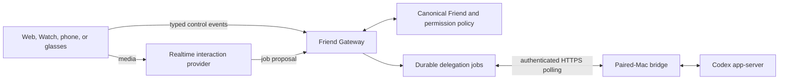

# Friend Gateway Design

**Date:** 2026-07-31
**Status:** Approved product direction
**Audience:** Contributors and orchestration agents

## Decision

OpenFriend will own one thin, trusted Friend Gateway rather than an embedded
general-purpose agent runtime. The gateway is initially a set of stateless
modules and HTTP routes in the existing web service, with durable state in
Supabase Postgres. It owns identity, bounded relationship context, delegation
jobs, approvals, status, cancellation, and truthful results. It does not own an
agent loop, shell, browser automation, generic executor registry, or hosted
sandbox.

The product has two paths:

1. The fast interaction path connects capable clients directly to the selected
   realtime provider over WebRTC. Server-minted credentials and deterministic
   tool handling keep secrets and policy out of clients. The live model may
   propose a job; it cannot execute arbitrary host work.
2. The durable delegation path records a bounded job, applies approval policy,
   and exposes authenticated HTTPS polling to one paired Mac. The first and
   only v1 executor is Codex app-server on that Mac. No second connector or
   executor interface is implemented.

## Deliberate constraints

- The Vercel service holds no long-lived bridge or provider socket and no
  correctness-critical in-memory state.
- Offline and timeout states are derived from durable timestamps at read time;
  cron is not required for correctness.
- The browser-to-provider Realtime session reuses the Phase 1 implementation;
  the server does not proxy live audio.
- Durable jobs and events are idempotent. `completed` requires a confirmation
  reference; an uncertain external write is never retried blindly.
- Approval is bound to the exact proposal and can be written only by a human
  principal. Pairing never grants standing approval for consequential actions.
- Memory is default-deny in delegated context and Codex output never becomes
  relationship memory automatically.
- Watch transport, full memory tables, native iPhone, glasses, additional Macs,
  other executors, queues, and hosted sandboxes remain separately accepted
  future work.

## Review record

Andrew approved this direction on 2026-07-31. A subsequent Fable/high read-only
review approved it with corrections: use serverless-safe HTTPS polling, keep
the Codex integration singular, avoid pulling candidate memory stories into
the first control-plane slice, add a clear account/authentication boundary, and
gate a production bridge behind real-Mac app-server evidence. Those corrections
are incorporated here and in the implementation plan.
